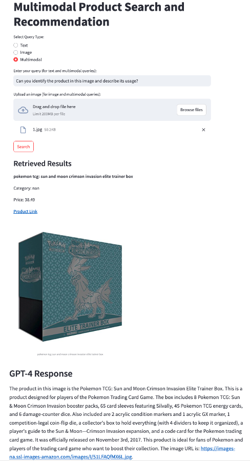
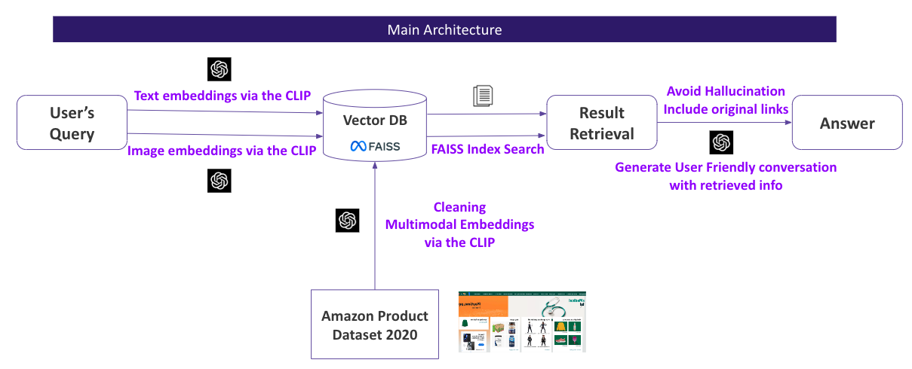

# Multimodal Conversational AI for E-Commerce

This project developed a chatbot using Contrastive Language-Image Pre-training (CLIP), capable of simultaneously taking text and image inputs and answering questions about the products on an e-commerce website.

Team Members: Daichi Ishikawa, Liang Gong, Haoran Zheng

- **User Interface:** [https://multimodal-conversational-ai-e-commerce.streamlit.app/](https://multimodal-conversational-ai-e-commerce.streamlit.app/)

# Main Architecture

Through the use of metadata-driven routing and RAG fusion techniques, we achieved high performance in question answering.

